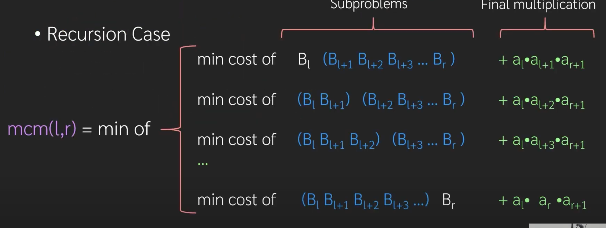
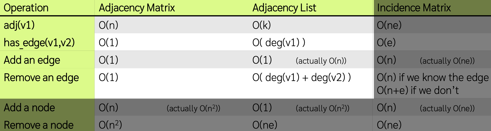

# Algorithm design

## content
1. [Chap 1: Brute Force](#brute-force)
2. [Chap 2: Sorting](#sorting)
3. [Chap 3: Complexity Analysis and Recursion](#complexity-analysis-and-recursion)
4. [Chap 4: Divide & Counquer](#divide-&-counquer)
5. [Chap 5: Dynamic Programming](#dynamic-programming)
6. [Chap 6: Graph](#graph)
7. [Chap 7: Shortest Path](#shortest-path)
8. [Chap 8: State Space Search](#state-space-search)
7. [Chap G: Greedy Algorithm](#greedy-algorithm)

# Intro
instance
admissble instance

# Brute Force
CSP -  less than 10?
COP - how many?
what is constraints?????

- ex : write
    * def of a candidate sol
    * a candidate sol set
    * func to check if that candidate valid
    * is COP? CSP?
        o id COP what is the objective

# Sorting
1. Selection Sort
    - 2 parts -> Unsorted array and Sorted array
        - While Unsorted !empty
        - get maximum -> put it in front of Sorted
        - delete from Unsorted
        - we can use just one array
    - **Heap Sort** 
        - turn array into heap (fix down from half till top) (O(n))
        - swap with index last-------- -> fix down
2. Insertion Sort
    - don't have to find maximum
    - insert in to the correct position
    - **Shell Sort**
        - divide in to smaller group (1,2,3,4,5,6,7) -> (1,4,7),(2,5),(3,6)
        - sort each sub-array(insertion sort)
        - repeat with smaller G (less sub-group) till G = 1 

# Complexity Analysis and Recursion

# Divide & Counquer
- algorithm design framework
- Divide it into smaller instance of the same type
- Use recursive to solve subproblem
- Counquer (combine) the result
1. **Binary Search**
2. **Merge Sort**
    - divide into half sort then merge
    - need temp space
    - really good with linked list
3. **Quick Sort** 
    - pivot
    - sub1 contains only <= pivot, sub2 contains only >= pivot
4. **Modular Exponentiation** 
    - calculate a^n mmod k
    - use in RSA (public key crytography)
        - m: p*q where p and q are large prime number
        - e: any int fromLCM(p-1,q-1)
        - d: modular inverse of e
        Encrypt a value to t as c = t^e mod m
        Decrypt a value to c by t = c^d mod m
        - n = x+y ; a^n mod k =?
        = (a^x mod k * a^y mod k) mod k
5. **Maximum Subarray Sum** 
    - [ex max](grader/ex01e2.cpp)
6. **Strassen's Matrix Multiplication**
    - 

# Dynamic Programming
    - Divide & Conquer + Lookup Table
    - for divide & conquer the subproblem overlap, so we use dynamic programming
1. **Fibonacci Number**
    - [ex fibo](grader/ex02e1_fibo.cpp)
    - **Top-Down** - use divide and conquer
    - **Bottom-up** - add the table till wanted cell, don't have to be recursive
2. **Binomial Coefficient**
    - [ex: bino](grader/ex02e2_cnk.cpp)
    - choose r things from n things
    - C<sub>n,r</sub> = C<sub>n-1,r</sub> + C<sub>n-1,r-1</sub>
    - bottom-up use pascal triangle
3. **Kandane's Algorithm**
    - for maximun subarray sum
    - instead for divide into n/2,n/2 , divide into n-1,1
4. **Matrix Chain Multiplication**
    - best group to multiply
    - 
    - [ex: mcm](grader/ex03e2_mcm.cpp)
5. **Knapsack**
    - [ex: 01-Knap](grader/a60a_midp1_knapsack.cpp)
6. **Coin Change**
    <!-- !!ไปดู -->
7. **Longest Common Subsequence**
    <!-- !ยังไม่ได้ทำ bottom up -->
    - [ex: LCS](grader/ex03e1_lcs.cpp)


# Graph
- Recap
    - Path
        - Simple path: no dup node
        - Circuit: first node and last node is the same node
        - Simple curcuit: the only dup node is the last ans first node
- **Data Strcture of graph**
    - Adjacency Matrix 
        - 2D array
        - 1 when there is an edge
        - dense ( e -> n^2 )
    - Adjacency List
        - list of neighbor
        - sparce (e~n)
    - Incidence matrix
        - rows -> nodes, columns->edges (1 when node in edge connect)
    - 
- **Depth First Search**
    - use stact
- **Breath First Search**
    - use queue
- **Topo Sort**
    - use inner degree
- **Mininum Spaning Tree**
    - **Kruskal** 
        - start with all node with no edges
        - pick lightest edge first and doesn't make cycle (both vertex are not connect)
            - use disjoint set 
                - use tree point at parent
                - p[x] = parent of node x, if -1 mean root
        - for sparse graphs
    - **Prim's**
        - Select the minimal node & edge of all edges that connects to the original graph
        - choose the best edge form connectible
        - for dense graphs

# Shortest Path
- **Dijkstra**
    - clock??? not suitable with negative edge
- **Bellman-Forf**
    - table negative egde fine but slower
- **Floyd-Warshall**
    - for all pair shortest path
    
# State Space Search
- Next level brute force
    - which order should we enumerate the member (<ins>BFS</ins> and <ins>DFS</ins> topic)
    - Can we reduce the size of the search space (<ins>Backtracking</ins> and <ins>Branch-and-Bound</ins>)
- **8-queen**
    - queens' place that they cannot capture each other
    - [n-queen](grader/ex07e1_nqueen.cpp)
- **DFS ans BFS** 
- **Triple and Half**
    - *3 / 2
    - infinite space -> BFS
- **Backtracing**
    - we should not generate states that will never be the solution
- **Branch-and-Bound**
    - Backtracking for COP(constraint optimization problem - find best)
    - uses a bounding heuristic 
        - can overestimate but don't underestimate
    - [0/1 Knapsac with Real Number](grader/ex07m1_​knapsack.cpp)
- **Least Cost Search** aka. **Best First Search**
    - try to find good solution asap so that B&B can benefit on this
    - use priority queue of heuristic
    - [15 Puzzle](grader/ex07m2_15puzzle.cpp)

# Greedy Algorithm
- works correctly on just some problem
- **Rational Knapsack**
    - take the best price/weight ratio first
    - O(nlongn) from sorting 
    - [Fractional Knapsack](grader/ex04e2_fknapsack.cpp)
- **Activity Selection**
    - *N* jobs, each scheduled to *start* and *stop*, must pick as many as possible jobs that no time conflict
    - sort by stop time first
    - [Interval Selection](grader/ex04e1_interval.cpp)
note:
```cpp
#include <iomanip>
cout << fixed << setprecision(4) << maxV;
// ! if not fully correct try double and don't caculate useing float if not nessesary
```